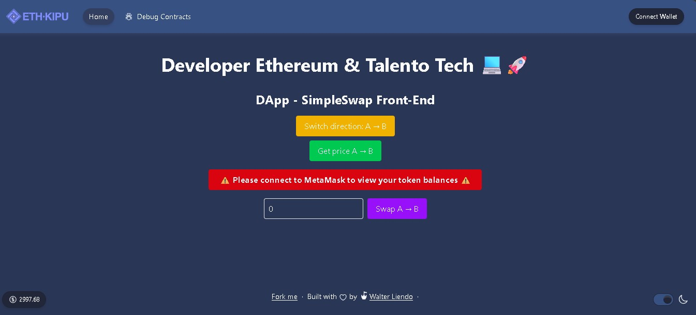

# 🦄 SimpleSwap DEX

This project implements a decentralized exchange (DEX) similar to Uniswap V2, written in Solidity and powered by React and Scaffold-ETH for the frontend.

## 🖼️ DApp Interface



---

## 📦 Contracts Deployed on Sepolia

- **TokenA**: [0x2c5dE7ce59F2540Fc6993966b12A4F92D3f8Bd28](https://sepolia.etherscan.io/address/0x2c5dE7ce59F2540Fc6993966b12A4F92D3f8Bd28)
- **TokenB**: [0x9167460d361769a62A447847EEecE91Df135d8f6](https://sepolia.etherscan.io/address/0x9167460d361769a62A447847EEecE91Df135d8f6)
- **SimpleSwap**: [0xBF24790A19EB7b52944bC0a514bc9848a4C56387](https://sepolia.etherscan.io/address/0xBF24790A19EB7b52944bC0a514bc9848a4C56387)

---

## 🚀 Features

### ✅ Smart Contract Functionality

- **Liquidity Management**
  - `addLiquidity`
  - `removeLiquidity`
- **Token Swapping**
  - `swapExactTokensForTokens`
- **Price Queries**
  - `getPrice`
  - `getAmountOut`
- **Math Utilities**
  - `sqrt`

### 🧪 Testing

Unit tests written in TypeScript with Hardhat and Chai:

- ✅ Add & Remove Liquidity
- ✅ Swap Functionality
- ✅ Deadline Validation
- ✅ Price Calculation

**Coverage Report:**

- Statements: 97.37%
- Branches: 50.00%
- Functions: 100.00%
- Lines: 93.22%

> ✅ Meets EthKipu's minimum threshold of **≥ 50%** coverage

---

## 📁 Project Structure

```
packages/
├── hardhat/
│   ├── contracts/
│   │   ├── SimpleSwap.sol
│   │   ├── TokenA.sol
│   │   └── TokenB.sol
│   ├── deploy/
│   │   ├── 00_deploy_tokenA.ts
|   |   ├── 01_deploy_tokenB.ts
|   |   ├── 02_deploy_simpleSwap.ts
│   │   └── 03_add_liquidity.ts
│   ├── test/
│   │   └── SimpleSwap.test.ts
│   └── hardhat.config.ts
├── nextjs/
│   └── (React + Scaffold-ETH frontend)
```

---

## 🖼️ Frontend Features

- ✅ MetaMask Integration
- ✅ Token Swap Interface
- ✅ Liquidity Pool Information
- ✅ Live Price Display
- ✅ Token Faucet for testing
- 🔧 Built using `wagmi`, `viem`, and `rainbowkit`

---

## 🧪 Deployment & Verification

**Deploy Contracts**

```bash
cd packages/hardhat
yarn hardhat deploy --network sepolia
```

**Verify Contracts**

```bash
yarn hardhat verify --network sepolia <contract_address> <constructor_args>
```

**Demo Requirements** (if submitting a video):

- ✅ Show token `approve` via frontend
- ✅ Call `getPrice` or `getAmountOut`
- ✅ Show successful transaction and Etherscan link

---

## 📄 NatSpec Documentation

All smart contracts are documented with Solidity NatSpec:

- ✅ Public and external functions
- ✅ Events with parameters
- ✅ State variables and modifiers

---

## 🧰 Getting Started

```bash
cd packages/hardhat
cp .env.example .env
yarn install
yarn deploy --network sepolia

cd packages/nextjs
cp .env.example .env.local
yarn install
yarn dev
```

---

## 🙌 Acknowledgements

- Scaffold-ETH 2
- Hardhat
- OpenZeppelin
- Viem / Wagmi / RainbowKit
- EthKipu Community

---

## 👨‍🎓 Author

**Walter Liendo** – Student at EthKipu